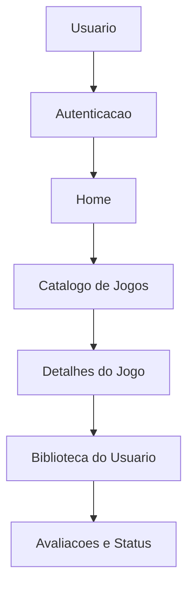

# Mapa do Projeto

Esta nota e o ponto de entrada da wiki do [[GameVault]]. Use este mapa para navegar entre contexto do produto, documentacao tecnica, organizacao visual e planejamento.

> [!info] Estado atual
> A wiki esta sendo construida em etapas. A fundacao inicial conecta os documentos existentes e prepara os links para as proximas notas tecnicas.

## Projeto

- [[GameVault]]: visao geral do produto, objetivo e areas principais.
- [[Plano de Wikificacao do GameVault]]: roteiro de evolucao da wiki.

## Documentos Existentes

- [README principal](../../../README.md): objetivo, funcionalidades, modelo de dados e instrucoes para rodar o projeto.
- [[Entrega2]]: requisitos academicos da segunda entrega.
- [[DOCUMENTACAO_CSS]]: documentacao da organizacao atual do CSS.
- [[PLANO_REORGANIZACAO_CSS]]: plano usado para modularizar os estilos.

## Visual

- [[GameVault.canvas|Canvas do GameVault]]: mapa visual do produto, fluxo funcional e camada tecnica.
- [[Projeto GameVault.base|Base do Projeto GameVault]]: tabela navegavel das notas da wiki.

## Areas da Aplicacao

- [[Funcionalidades]]: mapa das funcionalidades do produto.
- [[Autenticacao]]: cadastro, login e perfil do usuario.
- [[Catalogo de Jogos]]: listagem e detalhes dos jogos cadastrados.
- [[Biblioteca do Usuario]]: biblioteca pessoal e status dos jogos.
- [[Paginas Institucionais]]: home, sobre e diferenciais.
- [[Indice de Funcionalidades]]: caminho recomendado para leitura funcional.

## Documentacao Tecnica

- [[Arquitetura]]: organizacao geral do projeto Django.
- [[Models]]: entidades e relacionamentos do banco.
- [[Views e URLs]]: rotas, views e fluxo de paginas.
- [[Templates]]: estrutura dos templates Django.
- [[Static e CSS]]: organizacao de arquivos estaticos e estilos.
- [[Indice Tecnico]]: caminho recomendado para leitura tecnica.

## Planejamento

- [[Entrega Final - Alternativa A]]: plano consolidado para a entrega final do projeto.
- [[Spec - Email Verificacao e Reset de Senha]]: plano de email unico, verificacao e recuperacao de senha.
- [[Spec - Listas Personalizadas]]: plano para interface futura de listas do usuario.
- [[Spec - Foto de Perfil]]: plano para trocar avatar por foto real.
- [[Spec - Integracao Steam]]: plano para integrar o catalogo com dados da Steam.
- [[Plano de Saneamento do Codigo]]: lotes tecnicos para estabilizar o projeto antes de novas features.
- [[Backlog Pos-Entrega]]: melhorias futuras que nao bloqueiam a entrega final.
- [[Dificuldades Tecnicas]]: pontos de maior complexidade e refinamento do projeto.
- [[Decisoes Tecnicas]]: decisoes importantes tomadas durante o desenvolvimento.
- [[Pendencias]]: tarefas e lacunas conhecidas.
- [[Proximas Melhorias]]: ideias para evolucao do projeto.
- [[Limpeza do Vault]]: consolidacao da wiki e reducao de ambiguidades no Obsidian.

## Organizacao da Wiki

```text
Docs/Wiki/
  00 - Inicio/
  01 - Projeto/
  02 - Tecnico/
  03 - Funcionalidades/
  04 - Visual/
  05 - Planejamento/
```

- `00 - Inicio/`: ponto de entrada e mapas de navegacao.
- `01 - Projeto/`: contexto geral do GameVault.
- `02 - Tecnico/`: arquitetura, models, views, URLs, templates e static.
- `03 - Funcionalidades/`: notas sobre areas do produto.
- `04 - Visual/`: CSS, interface, imagens e canvas visual.
- `05 - Planejamento/`: planos, decisoes, pendencias e proximas melhorias.

## Fluxo Resumido



## Proximos Passos

- [x] Validar os nomes das notas centrais.
- [x] Criar a documentacao tecnica inicial.
- [x] Criar as notas de funcionalidades.
- [x] Criar o canvas visual do projeto.
- [x] Criar uma base do Obsidian para navegar pelas notas.
- [x] Criar notas de decisoes, pendencias e proximas melhorias.
- [x] Executar limpeza e consolidacao do vault.
