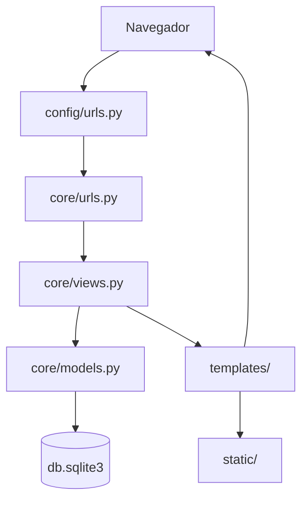

# Arquitetura

O [[GameVault]] e uma aplicacao Django MPA com renderizacao no servidor. A estrutura principal e dividida entre configuracao do projeto, app de dominio, templates HTML e arquivos estaticos.

## Visao Geral

```text
config/      configuracao global do Django
core/        app principal com models, urls e views
static/      CSS, imagens e arquivos publicos
Docs/Wiki/   documentacao navegavel no Obsidian
db.sqlite3   banco local de desenvolvimento
```

## Componentes Django

- `config/settings.py`: define apps instalados, banco SQLite, templates, static e media.
- `config/urls.py`: registra o admin e delega as rotas da aplicacao para `core.urls`.
- `core/urls.py`: concentra as rotas do produto.
- `core/models.py`: define entidades persistidas no banco.
- `core/views.py`: controla renderizacao de paginas, autenticacao, catalogo, biblioteca e avaliacoes.

## Fluxo de Requisicao



## Configuracao Atual

- `INSTALLED_APPS` inclui os apps padrao do Django e o app `core`.
- `TEMPLATES[0].DIRS` aponta para a pasta raiz `templates/`.
- `DATABASES.default` usa SQLite em `db.sqlite3`.
- `LANGUAGE_CODE` esta configurado como `pt-br`.
- `TIME_ZONE` esta configurado como `America/Sao_Paulo`.
- `STATICFILES_DIRS` aponta para `static/`.
- `MEDIA_ROOT` aponta para `media/`.

## Rotas De Alto Nivel

- `/`: home.
- `/sobre/`: pagina institucional.
- `/login/`, `/steam/login/`, `/logout/`, `/register/`, `/profile/`: autenticacao e perfil.
- `/catalog/`: catalogo de jogos.
- `/game/<id>/`: detalhe do jogo.
- `/steam-game/<app_id>/`: detalhe de jogo vindo da Steam.
- `/library/`: biblioteca pessoal.
- Endpoints JSON para biblioteca e avaliacoes.
- Rotas auxiliares para verificacao de email, reset de senha e sync da biblioteca Steam.

## Notas Relacionadas

- [[Models]]
- [[Views e URLs]]
- [[Templates]]
- [[Static e CSS]]
- [[GameVault]]
