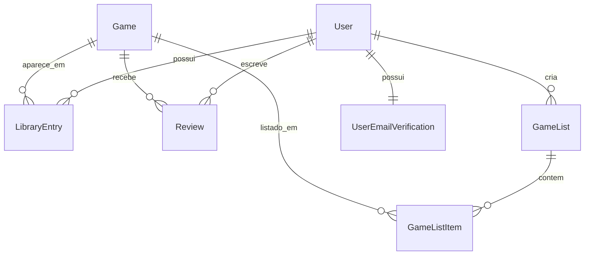

# Models

Os models do [[GameVault]] ficam em `core/models.py` e representam o catalogo de jogos, a biblioteca pessoal do usuario, avaliacoes, listas personalizadas e o estado de verificacao do email do usuario.

## Entidades

### Game

Representa um jogo disponivel no catalogo.

Campos principais:

- `title`: titulo do jogo.
- `description`: descricao opcional.
- `release_date`: data de lancamento opcional.
- `genre`: genero opcional.
- `cover_image`: URL da capa.
- `created_at` e `updated_at`: controle de criacao e atualizacao.

Regras:

- Ordenacao padrao por `title`.
- Nome amigavel no admin: `Jogo` e `Jogos`.

### LibraryEntry

Representa a relacao entre um usuario e um jogo salvo na biblioteca pessoal.

Campos principais:

- `user`: usuario dono da entrada.
- `game`: jogo relacionado.
- `status`: estado do jogo na biblioteca.
- `progress`: progresso em porcentagem.
- `added_at` e `updated_at`: controle temporal.

Status possiveis:

- `playing`: Jogando.
- `completed`: Concluido.
- `paused`: Pausado.
- `dropped`: Abandonado.
- `plan_to_play`: Planejo Jogar.

Regra importante:

- `unique_together = ["user", "game"]`: um usuario so pode ter uma entrada por jogo.

### Review

Representa uma avaliacao feita por um usuario sobre um jogo.

Campos principais:

- `user`: usuario autor da avaliacao.
- `game`: jogo avaliado.
- `rating`: nota de 1 a 5.
- `comment`: comentario opcional.
- `created_at` e `updated_at`: controle temporal.

Regra importante:

- `unique_together = ["user", "game"]`: um usuario so pode ter uma avaliacao por jogo.

### GameList

Representa uma lista personalizada criada por um usuario.

Campos principais:

- `user`: dono da lista.
- `name`: nome da lista.
- `description`: descricao opcional.
- `is_public`: indica se a lista e publica.
- `created_at` e `updated_at`: controle temporal.

Regra importante:

- `unique_together = ["user", "name"]`: um usuario nao pode ter duas listas com o mesmo nome.

### GameListItem

Representa um jogo dentro de uma lista personalizada.

Campos principais:

- `game_list`: lista relacionada.
- `game`: jogo incluido.
- `added_at`: data de inclusao.

Regra importante:

- `unique_together = ["game_list", "game"]`: o mesmo jogo nao aparece duas vezes na mesma lista.

### UserEmailVerification

Representa o estado de verificacao do email atual de um usuario.

Campos principais:

- `user`: usuario relacionado.
- `is_verified`: informa se o email atual foi confirmado.
- `verified_at`: data e hora da verificacao.
- `last_verification_email_sent_at`: controle do ultimo envio de email.

Regra importante:

- existe no maximo um registro por usuario, via `OneToOneField`.

## Relacionamentos

## Observacoes

- O projeto usa o model `User` padrao de `django.contrib.auth.models`.
- As constraints evitam duplicacao de jogos na biblioteca, avaliacoes duplicadas e itens duplicados em listas.
- O email do usuario fica em `User.email`, enquanto a verificacao desse email fica separada em `UserEmailVerification`.
- `LibraryEntry.progress` continua existindo no model, mas a interface atual da entrega prioriza status e avaliacao na experiencia principal.
- O `README` principal foi alinhado ao codigo atual durante a limpeza do vault.

## Notas Relacionadas

- [[Arquitetura]]
- [[Views e URLs]]
- [[Biblioteca do Usuario]]
- [[Catalogo de Jogos]]
