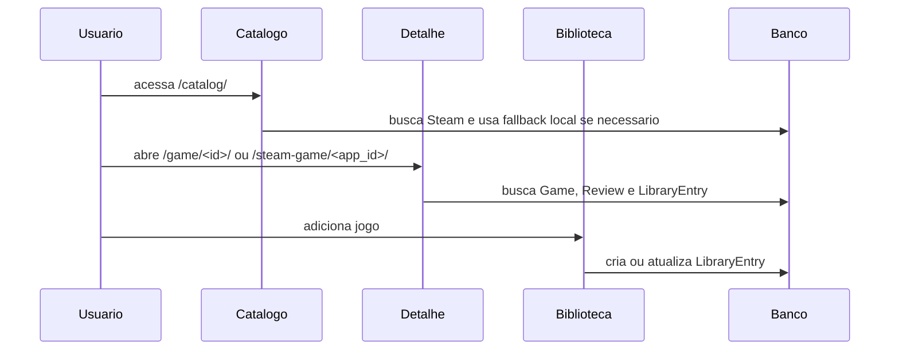

# Views e URLs

As rotas do [[GameVault]] sao definidas em `core/urls.py` e apontam para funcoes em `core/views.py`. O arquivo `config/urls.py` inclui essas rotas na raiz do projeto.

## Entrada De Rotas

`config/urls.py` registra:

- `/admin/`: admin do Django.
- `/`: todas as rotas do app `core`.
- `/media/`: arquivos locais servidos apenas em `DEBUG`, preparando uploads futuros como foto de perfil.

## Rotas Do App Core

| Caminho | Nome | View | Finalidade |
| --- | --- | --- | --- |
| `/` | `core:home` | `home_view` | Pagina inicial com jogos em destaque. |
| `/sobre/` | `core:sobre` | `sobre_view` | Pagina institucional. |
| `/login/` | `core:login` | `login_view` | Login de usuario. |
| `/steam/login/` | `core:steam_login` | `steam_login_view` | Inicia autenticacao via Steam OpenID. |
| `/steam/callback/` | `core:steam_callback` | `steam_callback_view` | Finaliza login com Steam e tenta sincronizar a biblioteca. |
| `/logout/` | `core:logout` | `logout_view` | Encerramento de sessao via `POST`. |
| `/password-reset/` | `core:password_reset` | `PasswordResetView` | Solicita redefinicao de senha por email. |
| `/password-reset/done/` | `core:password_reset_done` | `PasswordResetDoneView` | Confirma solicitacao de reset. |
| `/reset/<uidb64>/<token>/` | `core:password_reset_confirm` | `PasswordResetConfirmView` | Define nova senha. |
| `/reset/done/` | `core:password_reset_complete` | `PasswordResetCompleteView` | Confirma senha redefinida. |
| `/register/` | `core:register` | `register_view` | Cadastro de usuario. |
| `/profile/` | `core:profile` | `profile_view` | Perfil do usuario logado. |
| `/steam/sync-library/` | `core:steam_sync_library` | `steam_sync_library_view` | Reexecuta a sincronizacao da biblioteca Steam do usuario. |
| `/verify-email/<token>/` | `core:verify_email` | `verify_email_view` | Confirma email do usuario. |
| `/resend-verification-email/` | `core:resend_verification_email` | `resend_verification_email_view` | Reenvia verificacao de email. |
| `/library/` | `core:library` | `library_view` | Biblioteca pessoal. |
| `/add-to-library/` | `core:add_to_library` | `add_to_library_view` | Adiciona jogo via JSON. |
| `/update-library-entry/` | `core:update_library_entry` | `update_library_entry_view` | Atualiza status/progresso via JSON. |
| `/remove-from-library/` | `core:remove_from_library` | `remove_from_library_view` | Remove item da biblioteca via JSON. |
| `/catalog/` | `core:game_catalog` | `game_catalog_view` | Lista e busca jogos. |
| `/game/<game_id>/` | `core:game_detail` | `game_detail_view` | Exibe detalhes de um jogo. |
| `/steam-game/<app_id>/` | `core:steam_game_detail` | `steam_game_detail_view` | Exibe detalhe de jogo identificado por `app_id` da Steam. |
| `/game/<game_id>/review/` | `core:add_review` | `add_review_view` | Cria nova avaliacao no historico do usuario. |

## Grupos De Views

### Paginas publicas

- `home_view`: renderiza a landing page principal do produto.
- `sobre_view`: renderiza `templates/pages/sobre.html`.
- `game_catalog_view`: tenta buscar uma pagina do catalogo da Steam, normaliza os itens e faz fallback para o banco local se a consulta externa falhar.
- `game_detail_view`: mostra detalhes do jogo e avaliacoes.
- `steam_game_detail_view`: resolve um jogo por `steam_app_id`, sincroniza quando necessario e reaproveita o mesmo template de detalhe.

### Autenticacao

- `login_view`: usa `GameVaultAuthenticationForm`, aceita username ou email e redireciona para a biblioteca quando nao ha `next`.
- `steam_login_view`: redireciona o usuario para a autenticacao OpenID da Steam.
- `steam_callback_view`: valida o retorno OpenID, cria ou encontra a conta local vinculada e tenta sincronizar a biblioteca possuida na Steam.
- `logout_view`: exige `POST`, encerra a sessao e redireciona para home.
- `register_view`: usa `GameVaultUserCreationForm`, cria usuario com email, envia verificacao e autentica.
- `profile_view`: exige login com `@login_required`, permite editar username/email e tambem processa avatar local quando a conta nao usa avatar da Steam.
- `steam_sync_library_view`: reexecuta a importacao da biblioteca Steam a partir do perfil.
- `verify_email_view`: valida token e marca email como verificado.
- `resend_verification_email_view`: exige login e reenvia link de verificacao.
- Views nativas de reset de senha: solicitam, confirmam e concluem redefinicao por email.

O layout base tambem pode exibir um banner global quando o usuario autenticado ainda nao verificou o email.

### Biblioteca e avaliacoes

- `library_view`: exige login, lista entradas do usuario com `select_related("game")` e anexa a review mais recente do usuario para cada jogo.
- `add_to_library_view`: exige login, aceita JSON e `POST` tradicional, e usa `get_or_create` para evitar duplicidade.
- `update_library_entry_view`: exige login e `POST`; altera status e progresso.
- `remove_from_library_view`: exige login e `POST`; remove entrada da biblioteca.
- `add_review_view`: exige login; cria uma nova avaliacao no historico do usuario para um jogo.

Os fluxos AJAX principais agora usam um helper comum no frontend para lidar com:

- sessao expirada com retorno de HTML de login;
- resposta nao JSON;
- CSRF e `credentials` de mesma origem.

## Operacoes Tecnicas De Integracao

A integracao Steam hoje atua em tres frentes:

- servico interno `core/services/steam.py` para busca e sincronizacao de jogos;
- servicos `core/services/steam_auth.py` e `core/services/steam_library.py` para login e importacao da biblioteca do usuario;
- comandos administrativos como `python manage.py sync_steam_game <app_id>` e `python manage.py sync_steam_catalog ...`.

Mesmo com integracao externa, o produto continua priorizando persistencia local e fallback quando a Steam falha.

## Helpers De Imagem

`core/views.py` tambem possui funcoes auxiliares para capas:

- `resolve_variant_cover_image`: procura uma versao local da imagem em `static/img/<variant>/`.
- `resolve_variant_cover_position`: define posicionamento visual por titulo e variante.
- `attach_variant_cover_metadata`: anexa atributos temporarios aos objetos `Game` usados nos templates.

## Fluxo Catalogo Para Biblioteca

## Notas Relacionadas

- [[Arquitetura]]
- [[Models]]
- [[Templates]]
- [[Autenticacao]]
- [[Catalogo de Jogos]]
- [[Biblioteca do Usuario]]
