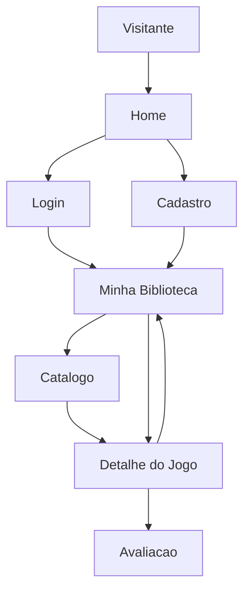

# Funcionalidades

Esta nota resume as principais funcionalidades do [[GameVault]] e aponta para as notas especificas de cada area. Ela reflete o estado atual do codigo e as principais evolucoes feitas durante os ajustes de entrega.

## Visao Geral

O produto permite que usuarios naveguem por um catalogo de jogos, criem uma conta com email, entrem com Steam, mantenham uma biblioteca pessoal, organizem o status dos jogos, registrem avaliacoes e recuperem acesso por email quando necessario.

## Areas Funcionais

- [[Autenticacao]]: cadastro, login local, login com Steam, logout, perfil, verificacao de email e recuperacao de senha.
- [[Catalogo de Jogos]]: busca e navegacao pelos jogos disponiveis, com apoio do catalogo da Steam e fallback local.
- [[Biblioteca do Usuario]]: jogos salvos pelo usuario, status e avaliacao pessoal.
- [[Paginas Institucionais]]: home e sobre para apresentacao do produto.

## Funcionalidades Implementadas No Codigo

| Funcionalidade | Status | Codigo principal |
| --- | --- | --- |
| Home com jogos em destaque | Implementada | `home_view`, `templates/pages/home.html` |
| Cadastro de usuario | Implementada | `register_view`, `templates/registration/register.html` |
| Login e logout | Implementada | `login_view`, `logout_view` |
| Login com Steam | Implementada | `steam_login_view`, `steam_callback_view` |
| Perfil do usuario | Implementada | `profile_view`, `templates/registration/profile.html` |
| Avatar local de perfil | Implementada | `GameVaultAvatarForm`, `profile_view`, `UserProfile` |
| Verificacao de email | Implementada | `verify_email_view`, `resend_verification_email_view` |
| Esqueci minha senha | Implementada | views nativas de `password_reset` |
| Catalogo com busca | Implementada | `game_catalog_view`, `templates/catalog/game_catalog.html` |
| Cache e sync de jogos Steam | Implementada | `core/services/steam.py`, `GameAdmin` |
| Detalhe do jogo | Implementada | `game_detail_view`, `templates/catalog/game_detail.html` |
| Adicionar jogo a biblioteca | Implementada | `add_to_library_view` |
| Remover jogo da biblioteca | Implementada | `remove_from_library_view` |
| Atualizar status da biblioteca | Implementada | `update_library_entry_view` e modal em `library.html` |
| Avaliar jogo | Implementada | `add_review_view` e modal no detalhe |
| Historico de reviews | Implementada | `add_review_view` cria nova review e a interface destaca apenas a mais recente |
| Sincronizar biblioteca Steam | Implementada | `steam_sync_library_view`, `core/services/steam_library.py` |
| Listas personalizadas | Modelada | `GameList` e `GameListItem`, sem fluxo de tela documentado no codigo atual |

## Fluxo Principal Do Usuario

## O Que Mudou Recentemente

- O login passou a aceitar username ou email.
- O cadastro passou a exigir email unico.
- O sistema ganhou verificacao de email sem bloquear login.
- O perfil passou a permitir editar username e email.
- O perfil passou a aceitar avatar local quando a conta nao depende da Steam.
- O fluxo de redefinicao de senha foi integrado por email.
- O produto ganhou login com Steam e sincronizacao opcional da biblioteca possuida.
- A biblioteca passou a priorizar status e avaliacao pessoal na UX da entrega.

## Dependencias Tecnicas

- [[Views e URLs]]: define as rotas e controllers das funcionalidades.
- [[Models]]: define `Game`, `LibraryEntry`, `Review`, `GameList`, `GameListItem`, `SteamAccountLink` e `UserProfile`.
- [[Templates]]: renderiza as telas acessadas pelo usuario.
- [[Static e CSS]]: sustenta a interface visual.

## Proximas Notas

- [[Autenticacao]]
- [[Catalogo de Jogos]]
- [[Biblioteca do Usuario]]
- [[Paginas Institucionais]]
