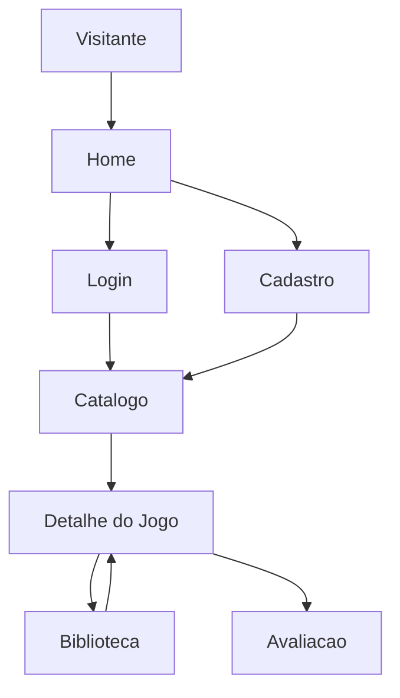

# Funcionalidades

Esta nota resume as principais funcionalidades do [[GameVault]] e aponta para as notas especificas de cada area.

## Visao Geral

O produto permite que usuarios naveguem por um catalogo de jogos, criem uma conta, mantenham uma biblioteca pessoal, acompanhem status/progresso e registrem avaliacoes.

## Areas Funcionais

- [[Autenticacao]]: cadastro, login, logout e perfil.
- [[Catalogo de Jogos]]: busca e navegacao pelos jogos disponiveis.
- [[Biblioteca do Usuario]]: jogos salvos pelo usuario, status e progresso.
- [[Paginas Institucionais]]: home, paginas demonstrativas e apresentacao do produto.

## Funcionalidades Implementadas No Codigo

| Funcionalidade | Status | Codigo principal |
| --- | --- | --- |
| Home com jogos em destaque | Implementada | `home_view`, `templates/pages/home.html` |
| Cadastro de usuario | Implementada | `register_view`, `templates/registration/register.html` |
| Login e logout | Implementada | `login_view`, `logout_view` |
| Perfil do usuario | Implementada | `profile_view`, `templates/registration/profile.html` |
| Catalogo com busca | Implementada | `game_catalog_view`, `templates/catalog/game_catalog.html` |
| Detalhe do jogo | Implementada | `game_detail_view`, `templates/catalog/game_detail.html` |
| Adicionar jogo a biblioteca | Implementada | `add_to_library_view` |
| Remover jogo da biblioteca | Implementada | `remove_from_library_view` |
| Atualizar status/progresso | Parcial | `update_library_entry_view` existe, mas a interface ainda e limitada |
| Avaliar jogo | Implementada | `add_review_view` e modal no detalhe |
| Listas personalizadas | Modelada | `GameList` e `GameListItem`, sem fluxo de tela documentado no codigo atual |

## Fluxo Principal Do Usuario

## Dependencias Tecnicas

- [[Views e URLs]]: define as rotas e controllers das funcionalidades.
- [[Models]]: define `Game`, `LibraryEntry`, `Review`, `GameList` e `GameListItem`.
- [[Templates]]: renderiza as telas acessadas pelo usuario.
- [[Static e CSS]]: sustenta a interface visual.

## Proximas Notas

- [[Autenticacao]]
- [[Catalogo de Jogos]]
- [[Biblioteca do Usuario]]
- [[Paginas Institucionais]]
